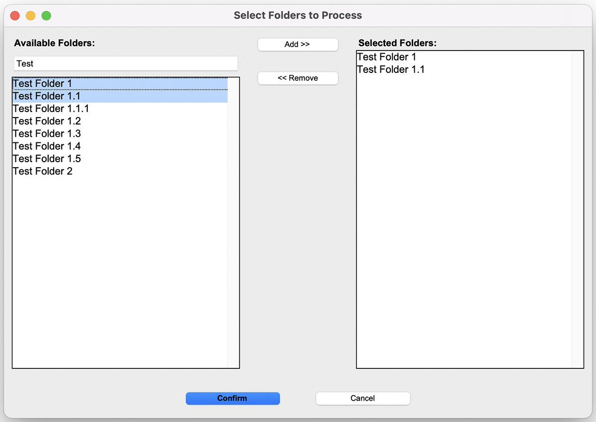
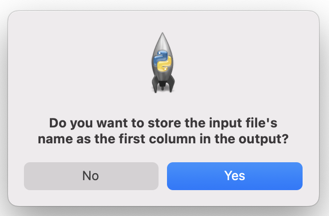
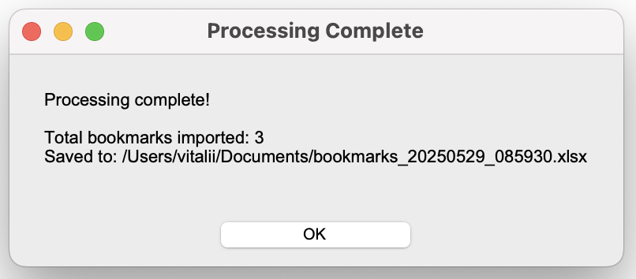
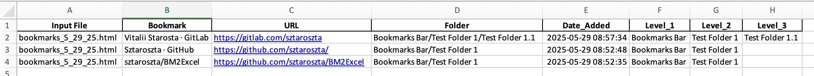
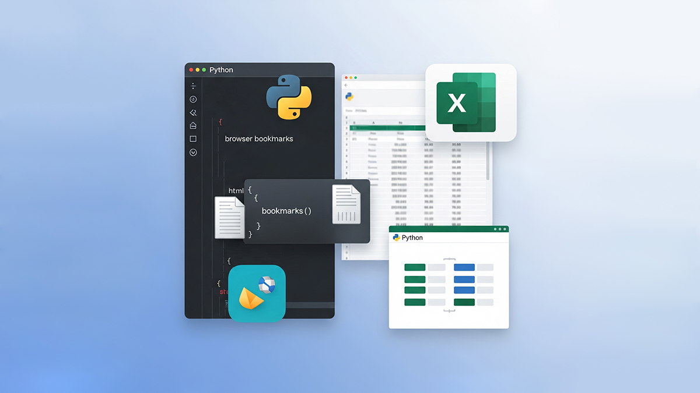

# BM2Excel

BM2Excel is a Python tool that converts HTML bookmarks into a structured, well-formatted Excel spreadsheet. It extracts bookmark data using BeautifulSoup, organizes folder hierarchies into separate columns, and outputs an Excel workbook that’s easy to analyze and report on 🔖 ➡️ 📊

**➡️ Read more about the project, its features, and development in my [Medium story.](https://medium.com/@starosta/bm2excel-python-bookmark-organizer-25ba822ad99c
)**


## Table of Contents

- [Overview](#overview)
- [Features](#features)
- [Installation](#installation)
- [Usage](#usage)
- [Project Structure](#project-structure)
- [Development](#development)
- [Known Issues](#known-issues)
- [Contributing](#contributing)
- [License](#license)
- [Contact](#contact)

## Overview

BM2Excel provides an intuitive GUI that allows users to:

1. **Select an HTML file** containing bookmarks.
2. **Choose specific folders** for processing via an interactive dialog.
3. **Extract and organize** bookmark information such as titles, URLs, folder paths, and dates.
4. **Export the data** to an Excel workbook using xlsxwriter, complete with custom formatting.

This tool aims to simplify the process of managing, sharing, and analyzing bookmark collections.

## Features

- **HTML Bookmark Extraction:** Recursively parses HTML to extract bookmarks and folder information.
- **Folder Organization:** Splits folder paths into separate columns (levels), making it easier to view and sort your data.
- **GUI-based Folder Selection:** Allows users to select which folders to process.
- **Excel Export:** Generates a neatly formatted Excel workbook with appropriate styling for URLs and dates.
- **Customizable:** Option to include the input file name as a column in the output.

## Installation

### Prerequisites

Ensure you have Python 3 installed. BM2Excel relies on the following libraries:
- `beautifulsoup4`
- `pandas`
- `xlsxwriter`
- `tkinter` (usually included with Python)

### Clone the Repository
```bash
git clone https://github.com/sztaroszta/BM2Excel.git
cd BM2Excel
```

### Install Dependencies

You can install the required dependencies using pip:

```bash
pip install -r requirements.txt
```

*Alternatively, install the dependencies manually:*

```bash
pip install beautifulsoup4 pandas xlsxwriter
```

## Usage

**1. Run the application:**

```bash
python bookmark2excel.py
```

**2. Follow the Prompts:**

- **Select HTML file**: A file dialog will appear; choose your bookmarks HTML file.
- **Folder Selection**: A GUI window will open showing your bookmark folders. Check the ones you want to process and click "Confirm".

- **Include Source Filename?**: You will be prompted to decide if you want to include the input file name in the output Excel file.

- **Save Excel File**: Choose the location and filename for the Excel output.

**3. Review the output:**

- A summary window will show the number of bookmarks processed and the location of the Excel file.
  
- Open the Excel file to review your organized bookmark data.
  The generated Excel file will have: 
` Each folder level in a separate column`,
` Bookmark titles, URLs, and dates`,
` Formatted hyperlinks and dates`
  

## Project Structure

```
BM2Excel/

├── bookmark2excel.py       # Main script for running the tool

├── README.md               # Project documentation

├── requirements.txt        # List of dependencies

├── .gitignore              # Git ignore file for Python projects

├── assets/                 # Contains screenshots of the application's UI and output file

└── LICENSE                 # GNU AGPLv3 License File

```
- **bookmark2excel.py**: Contains the complete program with all GUI components, bookmark processing logic, and Excel export functionality.
- **.gitignore**: Ensures that Python bytecode, local environment files, and other unnecessary artifacts are not tracked by Git.
- **assets/**: Contains screenshots that illustrate the application's user interface and functionality.
- **.LICENSE.**: Defines the usage rights under the GNU Affero General Public License v3.0

## Development

**Guidelines for contributors:**

If you wish to contribute or enhance BM2Excel:
- **Coding Guidelines:** Follow Python best practices. Use meaningful variable names and add comments or docstrings for clarity.
- **Testing:** Test changes locally before pushing. You can create sample bookmark HTML files to ensure the robustness of the extraction logic.
- **Issues/Pull Requests:** Please open an issue or submit a pull request on GitHub for enhancements or bug fixes.

## Known Issues

- The tool relies on proper HTML structure in the bookmark file. Malformed files may cause unexpected results.
- GUI dialogs might behave differently on various operating systems. Contributions to improve cross-platform compatibility are welcome.
: **Test Environment:** This code has been tested only on macOS. Users running it on Windows or Linux may encounter different behavior.

## Contributing

**Contributions are welcome!** Please follow these steps:

1. Fork the repository.
2. Create a new branch for your feature or fix.
3. Commit your changes with descriptive messages.
4. Push to your fork and submit a pull request.

For major changes, please open an issue first to discuss the proposed changes.

## License

Distributed under the GNU Affero General Public License v3 (AGPLv3).
See [LICENSE](LICENSE) for full details.

## Contact

For questions, feedback, or support, please open an issue on the [GitHub repository](https://github.com/sztaroszta/BM2Excel/issues) or contact me directly: 

[](https://www.linkedin.com/in/vitalii-starosta)
[](https://github.com/sztaroszta)
[](https://gitlab.com/sztaroszta)
[](https://bitbucket.org/sztaroszta/workspace/overview)
[]( https://gitea.com/starosta) 

Projects Showcase: [sztaroszta.github.io](https://sztaroszta.github.io)
```
Happy Bookmarking & Excel-ing!
```
**Version:** 8  
**Concept Date:** 2024-02-13 


